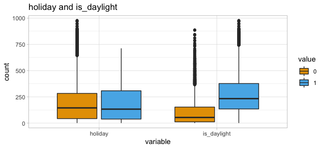
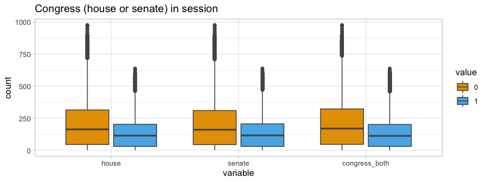
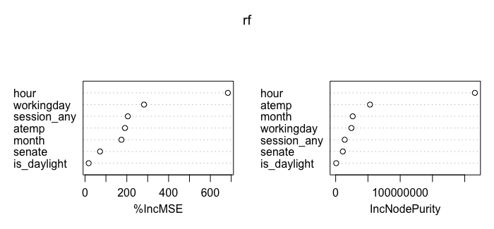
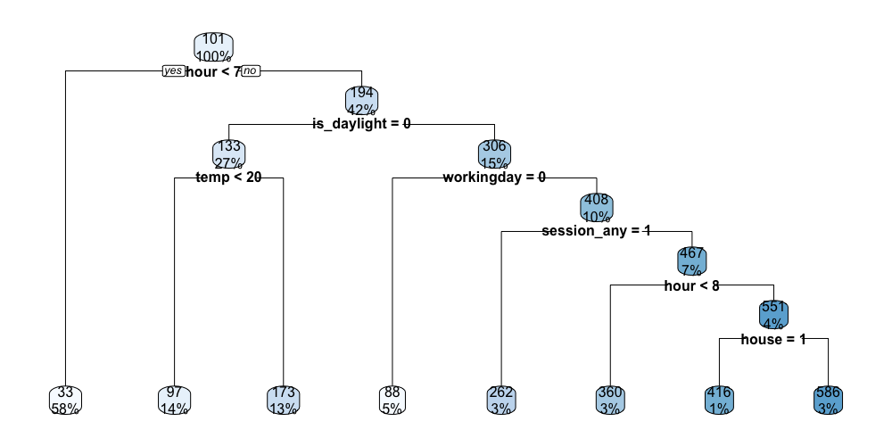

# Kaggle Bike Sharing Demand - a predictive solution in R

Kevin F. Cullen

    bike-sharing-models.R             Models. Partitioning. Transformations
    bike-sharing-plots.R              Plots.
    bike-sharing-setup.R              Read and manipulate data. Set variables. Explore.
    create+select.sql                 SQL. Transformations. Joins. Exploration.

Tools used

- R and RStudio
- MySQL / SQL
- Hitachi Vantara Pentaho PDI (ETL) (not needed to run this repo)
- MS Excel

## 1. Executive summary (TL;DR)

I taught myself R by developing predictive models for the Kaggle "Bike Sharing Demand" competition, originally as a topic for my final project in a data mining course at Colorado State University: <https://www.kaggle.com/c/bike-sharing-demand/overview>.

CIS 575 was taught via SAS Enterprise Miner. Because I was allowed to use R on the final project, I chose to teach myself R and its versions of the machine learning tools I was using in my SAS EM assignments.

This long-finished Kaggle competition is a prediction/forecasting exercise. I used a combination of models to predict demand for a bike sharing business:
- regression (linear, gam, multiple)
- neural networks
- regression trees
- random forests
- ensembles

This was a time series forecasting problem, but I was unable to treat it as such because...
- There were large chronological gaps in the data.
- The course only touched upon forecasting.
- I hadn't yet learned to impute time series values.

I decided to hunt down more predictive variables to add to the time series because...
- I got a chance to do a bit of ETL, cleaning, etc.
- The Kaggle data is mostly weather-related and difficult to know more than a few days in advance.
- I was new to machine learning and thought I might need more than newbie modeling skills to get decent results.

## 2. Predicting demand (`count`)

Kaggle provides these potential predictor/explanatory/independent variables

- datetime (hourly timestamp)
- season (categorical) 1 = spring, 2 = summer, 3 = fall, 4 = winter
- holiday (binary)
- workingday (binary) 1 if neither a holiday or weekend
- weather (categorical)
  - 1: Clear, Few clouds, Partly cloudy, Partly cloudy
  - 2: Mist + Cloudy, Mist + Broken clouds, Mist + Few clouds, Mist
  - 3: Light Snow, Light Rain + Thunderstorm + Scattered clouds, Light Rain + Scattered clouds
  - 4: Heavy Rain + Ice Pallets + Thunderstorm + Mist, Snow + Fog
- temp (double) Celsius
- atemp (double) "feels like" in Celsius
- humidity (integer) - relative humidity
- windspeed (double) wind speed, though units are not provided

Kaggle's target variable is `count`, but they provide component targets.
- casual (int) count by non-registered users
- registered (int) count by registered users

I ignored `casual` and `registered` because I didn't see how they could be used as a predictor. It turns out some people create ensemble models which combine predictions for the two targets and then add the results together to get `count`. I think that's clever.

### Submission format

The Kaggle challenge requests the following, where `count` is the number of bicycles rented in a given hour...

    datetime,count
    2011-01-20 00:00:00,0
    2011-01-20 01:00:00,0
    2011-01-20 02:00:00,0

### Evaluation statistic

Kaggle specifies Root Mean Squared Logarithmic Error (RMSLE), which seems ideal for this target variable. See <https://hrngok.github.io/posts/metrics/> for an example discussion.

- `count` has a wide range
- The heavily right-tailed distribution means percentage errors are more important than absolute value.
- A bike sharing scheme would probably want to penalize under-estimates more than over-estimates.
- Both the predicted and the actual can be big numbers, in which cases RMSLE doesn't penalize big differences.

## 3. Data

Related file(s)

    create+select.sql       transformations and joins
    bike_sharing.sql        (MySQL database export)
    kaggle_data_plus.csv    for import to R (test + train, kaggle + my additional data)

The Kaggle competition has the seed data. Download CSV files for training and test(scoring) from <https://www.kaggle.com/c/bike-sharing-demand/overview>.

Much of Kaggle's data is weather-related and cannot be accurately known beforehand... and even then without great accuracy. This would trouble me if I were making business decisions on such timeframes.

I added variables which could be known beforehand: sports schedules, university calendars, `is_daylight` and congressional sessions. (The latter can sometimes change on short notice.)

Some of this was ugly cut & paste from PDFs or HTML into Excel. I used Pentaho/Vantara PDI to load CSVs into a MySQL database for transformations and joins via SQL.

I pulled the following subsets together via SQL SELECT with several OUTER JOINs. I exported the data to a CSV file with MySQL's SELECT... INTO OUTFILE syntax and brought into R for further exploration.

### 3.a. House and Senate "in session" variables

Perhaps DC is busier when the legislators are around. I created CSV files from the official calendars of the 112th Congress (<https://www.congress.gov/past-days-in-session>).

    house       binary
    senate      binary

### 3.b. University calendars

University students are a prime demographic for bike sharing. I wanted to capture days when students were likely in town, but not burdened by exams, etc. I found 2011 calendars for the 3rd, 4th, and 5th-largest universities in the DC area (but not 1st or 2nd). I made a CSV to demark days I considered class to be in session. I included weekends but excluded: Thanksgiving breaks, spring breaks, exam weeks, and summer sessions.

    cua_session        binary    Catholic University of America
    au_session         binary    American University
    howard_session     binary    Howard University
    session_count      integer   # of universities in session
    session_any        binary    any universities in session?

### 3.c. Sunrise/sunset -> binary `is_daylight` variable

Cycling is more dangerous at night, so I found a 2011 sunrise/sunset calendar for the Washington, DC area at <https://www.sunearthtools.com/solar/sunrise-sunset-calendar.php>. I used Excel to create CSVs and loaded them into a MySQL table with Pentaho ETL:

    +---------+------+
    | Date    | date |
    | Sunrise | time |
    | Sunset  | time |
    +---------+------+

I used SQL to combine this with the Kaggle data and create a calculated binary `is_daylight` value for each observation.

### 3.d. Pro sports schedules (DC-area home games)

Who drives to a pro sporting event? I captured (in CSV files) time windows for professional sporting events held within the geographic footprint of the bike share service. I excluded the Washington Redskins because they play in Landover, Maryland... outside the bike sharing service area.

Formats varied greatly. Once the CSVs were in MySQL, I tweaked and joined them into a common table.

    +-----------+----------+
    | datetime  | datetime | To join with the Kaggle hourly time data.
    | capitals  | boolean  | Is there a game at this time?
    | nationals | boolean  | Game?
    | united    | boolean  | Game?
    | wizards   | boolean  | Game?
    +-----------+----------+

Using start times from the CSV files + typical game lengths, I used SQL to set the binary flag to TRUE for hours during which games were being held, along with a bit of buffer on either side for travel to and from the games. I excluded away games for all.

#### Washington Capitals (NHL)

Gathered from: <https://www.nhl.com/capitals/news/capitals-announce-composite-2010-11-television-schedule/c-537574> and <https://www.hockey-reference.com/teams/WSH/2012_games.html>

#### Washington Nationals (MLB)

Gathered from: <https://www.retrosheet.org/schedule/>

I had to convert their game time strings ("D" or "N") to typical game times.
- D (Day) ~13:05
- N (Night) ~19:05

#### Washington Wizards (NBA)

Gathered from: <https://www.basketball-reference.com/teams/WAS/2012_games.html>.

#### DC United (MLS)

Gathered from: <https://en.wikipedia.org/wiki/2011_D.C._United_season>

## 4. Data exploration (Plots)

Related file(s)

    bike-sharing-plots.R       R code

The data was clean. The only missing values were the counts (`casual`, `registered`, `count`) in the test (scoring) data set for submission to Kaggle.

    > describe(bikeall.df$count)
    bikeall.df$count
           n  missing distinct  Info   Mean      Gmd  .05    .10    .25    .50    .75    .90    .95
       10886   6493    822        1    191.6   193.3  5.0    9.0   42.0  145.0  284.0  452.0  563.8

    lowest :   1   2   3   4   5, highest: 943 948 968 970 977

### Target variable `count`
- ranged from 1 to 977
- median: 145
- mean: 191
- distribution: heavily right-tailed; peaks at far left (`count` = 1 to 5)

While examining the data, I noticed the distribution of `count` is quite different between day/night or peak/offpeak. I eventually used this to build some ensemble models.

### `datetime`, `hour`, `dayofweek`, and `month`

Kaggle provided `datetime`, an hourly timestamp. I extracted `hour`, `dayofweek`, and `month` from that because I thought they might be influential.

There are significant `count` peaks at 08:00 and 17:00 - 18:00 (presumably for rush hour).

Total `count` varied little by day of week. I dug deeper and discovered that timing of `count` did vary by day. My scatterplot and heatmap show very different patterns of `count` for weekends vs. weekdays.

### `holiday` and `is_daylight`

The `holiday` variable seemed a poor predictor. Unsurprisingly, usage tends to be much higher in daylight, though there are very high `count` outliers when `is_daylight` == 0.

### `weather` and `season`

`weather` and `season` seemed to influence demand. However, `count` was much lower in spring than other seasons. Perhaps the service launched that spring, or DC gets terrible weather in spring (snow, etc).

`weather` had 4 categorical values, but `weather` = 4 only appeared in three observations (among 10,000+ records). This caused problems in modeling because the value would sometimes only appear in validation, but not training.

### `temp`, `atemp` and `humidity`

My observations about temperature (both `atemp` and `temp`) were
- `count` tends to increase with atemp (and temp)
- `count` is rarely low when temp > 32
- `count` is rarely high when atemp < 10
- temperature in DC varies only ~5ºC during the day.
- `temp` and `atemp` ranged from 0.82 - 41 and 0 - 50 respectively. Presumably, the original data was transformed to eliminate temperature below 0 Celcius. (Washington DC has plenty of hours/year below freezing.)

`humidity` did not correlate to `atemp` or `atemp - temp`, as I expected. However...
- `count` drops as `humidity` rises beyond ~28.
- `humidity` is rarely < 25, and then generally only 13:00 - 17:00 (weekend high usage time).
- `weather` correlates strongly with `humidity`. As `humidity` rises, `weather` gets worse.
- `humidity` does not correlate with peaks in usage by hour.

### `windspeed`

`windspeed` ranged 0 - 56. It was clearly pre-binned into 30 distinct values with a curious gap between 0 & 6.0032. Median `count` was roughly even, regardless of speed.

### Congressional sessions

When the `house` and `senate` were in session, usage turned out to be lower. That may correlate with other variables, but I couldn't figure any out.

### Sporting events

Pro sports events (home games) seemed to correlate with increase in `count`, apart from Capitals games. I decided to make my own `sporting_event` variable to combine all four teams. However... the spike in `count` may be because games occur during busy periods (noon - 15:59 or after 17:59).

### University sessions

Universities all tended to be in or out of session at the same time (as seen in the histogram below). So... I created a consolidated `session_any` variable.

`count` was lower across the board when universities were in session. That surprised me. I thought this might be a proxy for `season`, since `count` is high in summer when universities are out of session. However, my boxplot showed the the `session_any` variable was a good predictor regardless of `season`.

## 5. Data preparation

Related file(s)

    bike-sharing-setup.R
    bike-sharing-models.R
    create+select.sql

Throughout, I had to manipulated various strings in SQL to make dates & times join up against Kaggle's datetime field. (`INSERT INTO... SELECT CONCAT`) (`LEFT OUTER JOIN... ON LEFT()`)

### 5.b. Replacements

- Replaced Nationals_Game_Time strings ("D" or "N") with typical game times so I could use them with other data.

### 5.c. Reductions

I thought about binning the `count` variable, but the object of the competition is to predict `count` accurately. So... using bins seemed like a bad way to get my Root Mean Squared Logarithmic Error (RMSLE) down.

The data from Kaggle appeared to have some previous binning. There were only 30 separate `windspeed` measurements.

`temp` and `atemp` had 50 and 65 distinct values and range for both had been shifted to start with 0. There were no units provided, but DC temperatures get below 0 Centigrade and rarely approach 0 Fahrenheit, so I am not sure what the exact prior transformation was.

`weather` was previously binned by the Kaggle competition. ~16 text descriptions were binned into four numeric values. Level 4 had only 4 observations, which caused all sorts of problems with modeling. Sometimes 4 would only appear in validation and not training.
1. Clear, Few clouds, Partly cloudy, Partly cloudy
2. Mist + Cloudy, Mist + Broken clouds, Mist + Few clouds, Mist
3. Light Snow, Light Rain + Thunderstorm + Scattered clouds, Light Rain + Scattered clouds
4. Heavy Rain + Ice Pallets + Thunderstorm + Mist, Snow + Fog

### 5.e. Derivations

I derived the following variables from existing data...
- From the dataset's `datetime` hourly time stamp
- `hour` (MySQL `HOUR()` function)
- `dayofweek` (MySQL `DAYOFWEEK()` function)
- `month` (MySQL `DAYOFWEEK()` function)
- `is_daylight`, calculated by comparing datetime field to daily sunrise/sunset values.
- `peak` binary variable, equal to 1 when 8 < hour < 21, to capture peak vs. offpeak usage after seeing the initial plotting.

I derived additional records for hours when people would be traveling to, attending, or traveling away from home games of 4 teams. I used SQL to `SELECT` start times for pro sporting events and then `INSERT` new records for the additional time periods. (`INSERT INTO... SELECT`)

### 5.f. Transformations

- Consolidated 4 sports teams' data into a single, binary `sporting_event` variable.
- Consolidated 3 binary variables (`cua_session`, `howard_session`, `au_session`) into 1 (`session_any`), as long as any were true, since they were generally true at the same times. These variables represented three universities.
- Consolidated `house` and `senate` binary variables into `congress_both` value.
- During preliminary data exploration, I made log_scale transformations on data (`windspeed`, `temp`) to aid me in visualizing, but I didn't think they would be helpful in models.
- While plotting, I noticed scale_y_sqrt() made some correlations more obvious because `count` on the y axis was very positively skewed. I added a count_sqrt variable to the MySQL export just in case.
- I made a `temp_squared` variable in SQL in case it was handy for predictions. It seemed to perform roughly the same as `temp` and `atemp`.

### 5.g. Scaling

For the neural network, I converted several factors back to numeric vectors and scaled all non-binary input variables based on techniques found in this tutorial: <https://datascienceplus.com/fitting-neural-network-in-r/>

Once I had scaled data for the neural network, I went back and used it to re-run and tinker with some of my models to see if I got better results.

## 6. Data modeling/analyses and assessments

Related file(s)

    bike-sharing-models.R        (R code)

### Partitions

Because this Kaggle data set has no validation values in the "test" data file, I created random training (60%) and validation (40%) data sets from the Kaggle train.csv file. I set a seed and used the same samples for all models when training & evaluating.

    ss <- sample(1:2, size = nrow(biketrain.df), replace = TRUE, prob = c(0.6, 0.4))
    training.df = biketrain.df[ss==1,]
    validation.df = biketrain.df[ss==2,]

### Models & final RMSLE (selective results)

These are only some of the models I created. Late in the project, I added two more variables (`month` and `is_daylight`) and re-tested. In many cases, these variables improved scores. I tried random forests last and was amazed how well they performed for this particular data set.

                                                         | Orig     | With month & is_daylight
    Model                                                | RMSLE    | RMSLE
    ---------------------------------------------------------------------------
    Random Forest                                        |          | 0.54403
    GAM + regression tree (partitioned day/off hours)    |          | 0.89011
    Regression tree - scaled data, no validation         | 0.89715  | unchanged
    Regression tree - scaled data                        | 0.90795  |
    Regression tree - optimized                          | 1.02692  | 0.93428
    Neural network - numeric  6 vars                     | 0.99700  | 0.99141
    Linear regression: 1 scaled var, partition day/night | 1.24144  | 1.68000
    Multiple linear regression w/ stepwise selection     | 1.64349  | 1.26428
    Neural network - numeric & binary                    | 1.58455  | 1.26794
    Multiple Linear regression                           | 1.28159  |

### Data used at modeling stage

    > str(biketrain.df)
    'data.frame':	10886 obs. of  33 variables:
     $ count              : int  16 40 32 13 1 1 2 3 8 14 ...
     $ hour               : int  0 1 2 3 4 5 6 7 8 9 ...
     $ dayofweek          : Factor w/ 7 levels "1","2","3","4",..: 7 7 7 7 7 7 7 7 7 7 ...
     $ month              : Factor w/ 12 levels "1","2","3","4",..: 1 1 1 1 1 1 1 1 1 1 ...
     $ is_daylight        : Factor w/ 2 levels "0","1": 1 1 1 1 1 1 1 1 2 2 ...
     $ peak               : logi  FALSE FALSE FALSE FALSE FALSE FALSE ...
     $ season             : Factor w/ 4 levels "1","2","3","4": 1 1 1 1 1 1 1 1 1 1 ...
     $ holiday            : Factor w/ 2 levels "0","1": 1 1 1 1 1 1 1 1 1 1 ...
     $ workingday         : Factor w/ 2 levels "0","1": 1 1 1 1 1 1 1 1 1 1 ...
     $ weather            : Factor w/ 4 levels "1","2","3","4": 1 1 1 1 1 2 1 1 1 1 ...
     $ temp               : num  9.84 9.02 9.02 9.84 9.84 ...
     $ temp_squared       : num  96.8 81.4 81.4 96.8 96.8 ...
     $ atemp              : num  14.4 13.6 13.6 14.4 14.4 ...
     $ humidity           : int  81 80 80 75 75 75 80 86 75 76 ...
     $ windspeed          : num  0 0 0 0 0 ...
     $ house              : Factor w/ 2 levels "0","1": 1 1 1 1 1 1 1 1 1 1 ...
     $ senate             : Factor w/ 2 levels "0","1": 1 1 1 1 1 1 1 1 1 1 ...
     $ congress_both      : Factor w/ 2 levels "0","1": 1 1 1 1 1 1 1 1 1 1 ...
     $ sporting_event     : Factor w/ 2 levels "0","1": 1 1 1 1 1 1 1 1 1 1 ...
     $ session_any        : Factor w/ 2 levels "0","1": 1 1 1 1 1 1 1 1 1 1 ...
     $ scaled_hour        : num  0 0.0435 0.087 0.1304 0.1739 ...
     $ scaled_dayofweek   : num  1 1 1 1 1 1 1 1 1 1 ...
     $ scaled_month       : num  0 0 0 0 0 0 0 0 0 0 ...
     $ scaled_season      : num  0 0 0 0 0 0 0 0 0 0 ...
     $ scaled_weather     : num  0 0 0 0 0 ...
     $ scaled_temp        : num  0.224 0.204 0.204 0.224 0.224 ...
     $ scaled_temp_squared: num  0.0572 0.048 0.048 0.0572 0.0572 ...
     $ scaled_atemp       : num  0.288 0.273 0.273 0.288 0.288 ...
     $ scaled_humidity    : num  0.81 0.8 0.8 0.75 0.75 0.75 0.8 0.86 0.75 0.76 ...
     $ scaled_windspeed   : num  0 0 0 0 0 ...
     $ house_num          : num  0 0 0 0 0 0 0 0 0 0 ...
     $ senate_num         : num  0 0 0 0 0 0 0 0 0 0 ...
     $ session_any_num    : num  0 0 0 0 0 0 0 0 0 0 ...

### Linear, polynomial, logarithmic regression - General

I tried over a dozen different combinations with lm(), glm(), gam(), etc. I also tried polynomial and logarithmic options with lm(). My best model split the data in two partitions: one for a generalized additive model ( gam() ) and the other for a regression tree.

NB: Linear regression created many negative predictions. Negative numbers cause errors when trying to calculate RMSLE, so I chose to convert negative predictions to 0.

    negative_to_zero <- function(predictions) {
      predictions[predictions < 0] <- 0
      return(predictions)
    }

### Multiple linear regression

My first decent prediction was based on my 11 best-guess variables and used all defaults. I picked the variables based on my observations. I adapted code from the textbook to build the model. Interestingly, the best predictors were mostly my derived or added variables. None of my scaled variables were chosen.

    Coefficients:
                 Estimate Std. Error t value             Pr(>|t|)
    (Intercept)    40.938     11.575    3.54              0.00041 ***
    hour            7.482      0.274   27.29 < 0.0000000000000002 ***
    dayofweek2     -0.569     11.648   -0.05              0.96103
    dayofweek3      9.737     13.063    0.75              0.45607
    dayofweek4      1.812     12.921    0.14              0.88849
    dayofweek5     10.790     13.060    0.83              0.40871
    dayofweek6      6.111     12.806    0.48              0.63327
    dayofweek7     14.418      6.569    2.19              0.02820 *
    season2        21.917      6.486    3.38              0.00073 ***
    season3        -0.800      8.234   -0.10              0.92258
    season4        75.622      5.414   13.97 < 0.0000000000000002 ***
    workingday1    25.189     11.432    2.20              0.02760 *
    humidity       -2.035      0.103  -19.68 < 0.0000000000000002 ***
    temp            8.080      0.394   20.49 < 0.0000000000000002 ***
    windspeed       0.338      0.230    1.47              0.14164
    house1        -37.060      6.280   -5.90         0.0000000038 ***
    senate1       -29.786      6.374   -4.67         0.0000030238 ***
    session_any1  -27.228      4.826   -5.64         0.0000000176 ***

### Linear Regression With Stepwise Variable Selection

These results surprised me. The stepwise variable selection chose many of my derived or added variables, but the RMSLE was originally the worst of all. Perhaps the model was over-fit. Even though this model performed poorly, I used the weights displayed by `summary()` to guide me when choosing variables for the neural networks and regression trees I built.

Late in the project, after I had added a number of predictors (including `is_daylight` and `month`), the scored RMSLE went from 1.64349 to 1.26428.

### Neural Network

This took me a while to get working.

- I had to scale variables, which required some code refactoring. I wrote my code to leave my target variable unscaled, though examples I saw also scaled the target.
- I added some binary predictors to the neural network without scaling, but they actually yielded a worse RMSLE.
- nn often finished with error that "Algorithm did not converge in 1 of 1 (or 3 or 3, or 4 of 4) repetition(s) within the stepmax."
  - I first thought this was due to lack of scaling, based upon recommendations I read.
  - The error continued even after scaling and tinkering with parameters.
- I spent a lot of time tinkering with the following to get a model to work
  - hidden: the hidden layers parameter
  - reps: number of training repetitions
- Training models took a long time. Especially when I used 7-10 variables.

When using only numeric predictors, I failed to make the neural network produce a model unless I left all settings at default and hand-picked the following variables:

    scaled_hour + scaled_dayofweek + scaled_temp + scaled_humidity + scaled_windspeed

I did create some neural networks with 2 hidden layers when I added some binary variables, but these models had the same results and RMSLE as the simpler, numeric-only models.

### Regression tree - optimized

The textbook was sparse on predicting continuous outcome variables with R, so I had to dig around the Internet for information on regression trees. I built this with heavy reliance on the following tutorial: <http://uc-r.github.io/regression_trees>

This tutorial explained how to

- Plot cp values.
- Perform a grid search with `hyper_grid()` to experiment with minsplit and maxdepth.
- Create a pruned, optimal tree

The RMSLE for this model was decent, depending upon the random sample used to build the tree. (I didn't set a seed at first.) I was surprised that a regression tree performed roughly equal to the neural networks, for which I had great hope.

### Regression Tree Using Scaled Data

Since I had already scaled the data and my neural network performed about the same as the regression tree, I decided to train another optimized regression tree with the scaled values. Performance was better, even using fewer variables. This was a pleasant surprise. (I used the <http://uc-r.github.io/regression_trees> again for optimization.)

For giggles, I finished by using my entire training data set to train this best regression tree model (no validation) and achieved a slight boost in RMSLE.

### Random Forest (most accurate)

The random forest explanation in the textbook was cursory, especially regarding regression. I decided to pop my data into their code examples and was immediately pleased with results. My RMSLE scores were < .3100 on training and validation. Kaggle-scored predictions scored RMSLE > 0.5.

I tried some of the tutorial code at <https://uc-r.github.io/random_forests> but could not get their code for selecting optimal `mtry` to work. In the end, I achieved my best Kaggle-scored RMSLE (0.54403) using some of my favorite predictors with default settings.

    # predictors: 'hour', 'month', 'is_daylight', 'workingday', 'atemp', 'senate', 'session_any'
    rf <- randomForest(count ~ ., data = rf_train.df, ntree = 500,
                         mtry = 4, nodesize = 5, importance = TRUE)

The following shows importance of each variable.

## 7. Ensemble Models

My visualizations showed distinctly different patterns of use between day and night. I decided to split my training and validation data by peak/offpeak hours (or using `is_daylight`). I originally built separate single-variable linear regression models for each and then split the test/scoring data to use with each model. This yielded better results than my multiple linear regression models.

### Combination: GAM and Regression Tree (2nd-most accurate)

Following my success with linear regression on partitioned data, I started testing different forms of regression and managed to get my RMSLE to ~ 0.6 for the peak hours using a general additive model (GAM). The offpeak hours had terrible results with these basic types of regression, so I trained an optimized regression tree on offpeak data. Combining the two models on my partitioned data yielded the 2nd best results.

    Family: gaussian
    Link function: identity

    Formula:
    count ~ s(atemp)

    Parametric coefficients:
                Estimate Std. Error t value            Pr(>|t|)
    (Intercept)   281.66       2.08     136 <0.0000000000000002 ***

    Approximate significance of smooth terms:
              edf Ref.df   F             p-value
    s(atemp) 8.33   8.85 176 <0.0000000000000002 ***

    R-sq.(adj) =  0.221   Deviance explained = 22.2%
    GCV =  23663  Scale est. = 23623     n = 5469

 peak hours")

## 8. Model Comparisons and Model Selection

I found a few R packages which claimed to calculate it RMSLE, but the RMSLE values calculated for my training & validation data were often quite different that what Kaggle calculated for my test/scoring dataset. I also used ME and RMSE figures from R's `accuracy()` function for initial testing, but those don't correlate well with RMSLE.

Once I thought a model was in decent working order, I submitted it to Kaggle. Unfortunately, Kaggle scoring can be slow and seemed to throttle my submissions after I had run 2-3 in a day. Therefore, I wasn't able to use my true test metric often.

After building my first set of models, I went back and used scaled data in them, but results weren't much improved. In the end, I simply sorted my Kaggle submissions by RMSLE to see which had worked the best.

Once I got the hang of linear, polynomial, multiple and GAM regression, I started to throw all sorts of variables into the mix. Most models faired poorly with one variable, but once I split into day/night hours, I got better results by partitioning and then training separate models.

The random forest was a last-minute addition that turned out to far out-perform others. If I had found it earlier in the process, I might have honed it better with time.

## 9. Conclusions and recommendations

I expected regression trees to perform the worst, but they were fairly accurate. Random forest was a great tool for this data set. I didn't originally try random forest because the textbook example was so brief.

Scaling data was useful and surprisingly easy. On a whim, I fed scaled data into my regression tree code and achieved a big boost in accuracy.

I was disappointed by the neural networks. Perhaps I could have done better with improved sampling and validation, but that might help all the models. Perhaps my 60% training and 40% validation split was a poor idea. I used the entire Kaggle data set (without partitioning) to re-train my best neural network. That led to a slight increase in accuracy.

In the hands of an expert, polynomial regression might have worked better than my models. I did not achieve meaningful gains with it.

I was pleased that the predictors I added to Kaggle's data were consistently weighted highly. These were both derived/decomposed variables and data I hunted down and added on my own.

Using forecasting and time series tools might yield better accuracy. I did not know how to use forecasting on a data set like this, where there were gaps in data every month. (Days 1-19 of each month were for training. Days 20-end of each month were in the test set and lacked values for the target `count` variable.) The textbook says "Nearly all standard forecasting methods cannot handle time series with missing values" (p. 395) Other sources I looked at stated the same thing. An expert might perform sophisticated imputation to make up for the missing data.

Barring the ability to use time series forecasting, I would try running separate random forests for peak and off-peak hours if I had more time.

