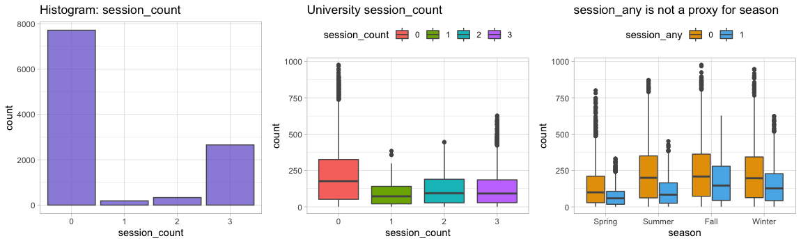

# Project - CIS 575 - Final Report - Kevin F. Cullen

## 1. Executive summary

This project is a prediction/forecasting exercise which used a combination of models (linear regression, neural networks, regression trees) to predict demand for a bike sharing business, using data from an old Kaggle competition.

This was a time series forecasting problem, but I was unable to treat it as such because...
- There were gaps in the data and I did not understand the explanations I read about imputing time series values. With more time, I may have figured it out.
- This course did not cover forecasting.

I chose to hunt down additional data to combine with the Kaggle dataset's predictor variables. My reasoning was...
1. The Kaggle data was already very clean. By hunting for my own data, I got a chance to do a bit of ETL, cleaning, etc.
1. The Kaggle data relied heavily on weather, which is difficult to know in advance (especially with any accuracy).
1. I have no experience with this sort of modeling, so I thought I might improve my results by using data which others had not.
1. It would show some original work on my own part.

The archive of public scores for this Kaggle competition shows an RMSLE range from 0.33756 to 23.38876 (excluding the single highest and lowest outliers) across a total of 12,967 entries. My best model had an RMSLE of 0.89715 and would be at 10,016th place.

## 2. Business problem/opportunity (from proposal)

I used the Kaggle "Bike Sharing Demand" competition as a basis for my project: <https://www.kaggle.com/c/bike-sharing-demand/overview>. Several versions of the data are on Kaggle. I chose what seemed the earliest & most detailed.

Bike sharing companies must balance availability and demand of their vehicles to ensure (a) customers can borrow a bike when they need it and (b) bikes are repaired and in in good order.

**Submission format:** The Kaggle challenge requests the following, where `count` is the number of bicycles rented in a given hour...

    datetime,count
    2011-01-20 00:00:00,0
    2011-01-20 01:00:00,0
    2011-01-20 02:00:00,0

**Evaluation statistic:** Root Mean Squared Logarithmic Error (RMSLE). Specified by the Kaggle competition.

Based on what I read, RMSLE is ideal for this target variable. See <https://hrngok.github.io/posts/metrics/> for an example discussion.

- `count` has a wide range
- The heavily right-tailed distribution means percentage errors are more important than absolute value.
- A bike sharing scheme would probably want to penalize under estimates more than over estimates.
- Both the predicted and the actual can be big numbers, in which cases and RMSLE doesn't penalize big differences.

## 3. Specific business objective(s) (from proposal)

Predict demand for bicycles, using time (date, time, holiday, weekday, season) and weather data. The various Kaggle competitions using this dataset do not make true business cases for the prediction based on ROI, etc. However, common sense dictates that sharing companies would want to use this data to keep costs low by having the lowest number of bicycles needed to meet demand. Predictions could also be used to schedule bicycle maintenance and relocation for slower times. (I have read about gig workers whose job is to move ride share bikes and scooters to more central locations.)

I was troubled by issues with separation of timeframes when making a prediction. In other words, much of this data was weather-related and could not be accurately known beforehand. The `casual` and `registered` variables are also collected as part of `count`, so I didn't see how they could be used as a predictor.

I added a number of variables to the dataset which could be known beforehand: sports schedules, university calendars, `is_daylight` and congressional sessions. (The latter can sometimes change on short notice.)

## 4. Process followed for selecting and gathering data

### 4.a. Kaggle Data

Downloaded CSV files for training and test data from <https://www.kaggle.com/c/bike-sharing-demand/overview>.

### 4.b. Additional Data Series I Found and Transformed

Some of this was ugly cut & paste from PDFs or HTML into Excel. I used Pentaho/Vantara PDI to load CSVs into a MySQL database for transformations and joins via SQL.

I pulled the following subsets together via SQL SELECT with several OUTER JOINs. I exported the data to a CSV file with MySQL's SELECT... INTO OUTFILE syntax and brought into R for further exploration.

Related files...

    create+select.sql       transformations and joins
    bike_sharing.kjb        (Pentaho PDI ETL Job)
    kaggle_data.ktr         (Pentaho PDI Transformation file)
    kaggle_data_plus.csv    unified data file (test + train, kaggle + my additional data)

#### 4.b.1. House and Senate "in session" variables [house-senate-in-session.csv]

Perhaps DC is busier when the legislators are around. I created CSV files from the official calendars of the 112th Congress (<https://www.congress.gov/past-days-in-session>). It took 20 minutes and seemed faster than screen-scraping.

Variables

    Date        iso date
    House       binary
    Senate      binary

#### 4.b.2. University calendars [dc-university-sessions.csv]

University students are a prime demographic for bike sharing. I wanted to capture days when students were likely in town, but not burdened by exams, etc. I found 2011 calendars for the 3rd, 4th, and 5th-largest universities in the DC area (but not 1st or 2nd). I made a CSV to demark days I considered class to be in session. I included weekends but excluded: Thanksgiving breaks, spring breaks, exam weeks, and summer sessions.

Variables...

    cua_session        binary    Catholic University of America
    au_session         binary    American University
    howard_session     binary    Howard University
    session_count      integer   # of universities in session
    session_any        binary    any universities in session?

#### 4.b.3. Pro sports schedules (DC-area home games)

Who drives to a pro sporting event? So, I captured (in CSV files) time windows for professional sporting events held within the geographic footprint of the bike share service. I excluded the Washington Redskins because they play in Landover, Maryland... outside the bike sharing service area.

Formats varied greatly. Once the CSVs were in MySQL, I massaged and joined them into a common table.

    +-----------+----------+
    | Field     | Type     |
    +-----------+----------+
    | datetime  | datetime | To join with the Kaggle hourly time data.
    | capitals  | boolean  | Is there a game at this time?
    | nationals | boolean  | Game?
    | united    | boolean  | Game?
    | wizards   | boolean  | Game?
    +-----------+----------+

Using start times from the CSV files + typical game lengths, I used SQL to set the binary flag to TRUE for hours during which games were being held, along with a bit of buffer on either side for travel to and from the games. I excluded away games for all.

##### 4.b.3.1. Washington Capitals (NHL) [capitals-schedule-2011.csv]

Gathered from: <https://www.nhl.com/capitals/news/capitals-announce-composite-2010-11-television-schedule/c-537574> and <https://www.hockey-reference.com/teams/WSH/2012_games.html>

    capitals    binary
    caps_date   iso date
    caps_time   (HH:mm:ss)

##### 4.b.3.2. Washington Nationals (MLB) [nationals-schedule-2011.csv]

Gathered from: <https://www.retrosheet.org/schedule/>

    Date                    string (yyyymmdd)
    Nationals_Game          binary
    Nationals_Game_Time     string

I replaced `Nationals_Game_Time` strings ("D" or "N") with typical game times.
- D (Day) ~13:05
- N (Night) ~19:05

##### 4.b.3.3. Washington Wizards (NBA) [washington-wizards-2011-schedule.csv]

Gathered from: <https://www.basketball-reference.com/teams/WAS/2012_games.html>.

    start_ET      time (HH:mm:ss)
    Date_iso      iso date

##### 4.b.3.4. DC United (MLS) [dc_united-2011-schedule.csv]

Gathered from: <https://en.wikipedia.org/wiki/2011_D.C._United_season>

    DC_United_Game_date      iso date
    time_ET                  time (HH:mm:ss)

## 5. Discussion of preliminary data exploration and findings

The data was clean. The only missing values were the counts in the test data set.

    > describe(bikeall.df$count)
    bikeall.df$count
           n  missing distinct  Info   Mean      Gmd  .05    .10    .25    .50    .75    .90    .95
       10886   6493    822        1    191.6   193.3  5.0    9.0   42.0  145.0  284.0  452.0  563.8

    lowest :   1   2   3   4   5, highest: 943 948 968 970 977

### Target variable `count`
- ranged from 1 to 977
- median: 145
- mean: 191
- distribution: heavily right-tailed; peaks at far left (count = 1 to 5)

### `datetime`, `hour`, `dayofweek`, and `month`

Kaggle provided `datetime`, an hourly timestamp. I extracted `hour`, `dayofweek`, and `month` from that because I thought they might be influential.

There are significant `count` peaks at 08:00 and 17:00 - 18:00 (presumably for rush hour).

Total `count` varied little by day of week. I dug deeper and discovered that timing of `count` did vary by day. My scatterplot and heatmap show weekend `count` has two different daily peaks which are broader and less distinct: 23:00 - 00:00 and 10:00 to 15:00 (possibly because people are cycling home from late night events and getting up late the next day).

### `holiday`

I tried several ways to examine the `holiday` variable, all of which showed little `count` difference for `holiday` vs. non-holiday (though holidays lacked the huge outliers found on other days).

### `weather` and `season`

`weather` and `season` seemed to influence demand. However, spring = 1 `count` was much lower than other seasons. Perhaps the service launched that spring.

Weather had 4 categorical values, but weather = 4 only appeared in three observations (among 10,000+ records). This caused problems in modeling because the value would sometimes only appear in validation, but not training.

### `temp`, `atemp` and `humidity`

My observations about temperature (both `atemp` and `temp`) were
- `count` tends to increase with atemp (and temp)
- `count` is rarely low when temp > 32
- `count` is rarely high when atemp < 10
- temperature in DC varies only ~5ºC during the day.
- `temp` and `atemp` ranged from 0.82 - 41 and 0 - 50 respectively. Presumably, the original data was transformed to eliminate temperature below 0 Celcius. (Washington DC has plenty of hours/year below freezing.)

`humidity` did not correlate to `atemp` or `atemp - temp`, as I expected. However...
- `count` drops as `humidity` rises beyond ~28.
- `humidity` is rarely < 25, but generally only 13:00 - 17:00 (peak usage time).
- `weather` correlates strongly with `humidity`. As `humidity` rises, `weather` gets worse.
- `humidity` does not correlate with peaks in usage by hour.

### `windspeed`

`windspeed` ranged 0 - 56. It was clearly pre-binned into 30 distinct values with a curious gap between 0 & 6.0032. Median `count` was roughly even, regardless of speed.

### Congressional sessions

When the `house` and `senate` were in session, usage turned out to be lower. That may correlate with other variables, but I couldn't figure any out.

### Sporting events

Pro sports events (home games) seemed to correlate with increase in `count`, apart from Capitals games. I decided to make my own `sporting_event` variable to combine all four teams. However... the spike in `count` may be because games occur during busy periods (noon - 15:59 or after 17:59).

### University sessions

Universities all tended to be in or out of session at the same time (as seen in the histogram below). So... I created a consolidated `session_any` variable.

`count` was lower across the board when universities were in session. That surprised me. I thought this might be a proxy for `season`, since `count` is high in summer when universities are out of session. However, my boxplot showed the the `session_any` variable was a good predictor regardless of `season`.

## 6. Description of data preparation

Related files:

    bike-sharing.R
    create+select.sql

### 6.a. Repairs

- Manipulated various strings in SQL to make dates & times join up against Kaggle's datetime field. (`INSERT INTO... SELECT CONCAT`) (`LEFT OUTER JOIN... ON LEFT()`)

### 6.b. Replacements

- Replaced Nationals_Game_Time strings ("D" or "N") with typical game times so I could use them with other data.

### 6.c. Reductions

I thought about binning the `count` variable, but the object of the competition is to predict `count` accurately. So... using bins seemed like a bad way to get my Root Mean Squared Logarithmic Error (RMSLE) down.

The data from Kaggle appeared to have some previous binning. There were only 30 separate `windspeed` measurements.

`temp` and `atemp` had 50 and 65 distinct values and range for both had been shifted to start with 0. There were no units provided, but DC temperatures get below 0 Centigrade and rarely approach 0 Fahrenheit, so I am not sure what the exact prior transformation was.

`weather` was previously binned by the Kaggle competition. ~16 text descriptions were binned into four numeric values. Level 4 had only 4 observations, which caused all sorts of problems with modeling. Sometimes 4 would only appear in validation and not training.
1. Clear, Few clouds, Partly cloudy, Partly cloudy
2. Mist + Cloudy, Mist + Broken clouds, Mist + Few clouds, Mist
3. Light Snow, Light Rain + Thunderstorm + Scattered clouds, Light Rain + Scattered clouds
4. Heavy Rain + Ice Pallets + Thunderstorm + Mist, Snow + Fog

### 6.d. Partitions

Because this Kaggle data set has no validation values in the testing data file, I created random training (60%) and validation (40%) data sets from the Kaggle train.csv file. I set a seed and used the same samples for all models when training & evaluating.

    ss <- sample(1:2, size = nrow(biketrain.df), replace = TRUE, prob = c(0.6, 0.4))
    training.df = biketrain.df[ss==1,]
    validation.df = biketrain.df[ss==2,]

### 6.e. Derivations

I derived the following variables from existing data...
- `hour` derived from built-in `datetime` hourly time stamp. (MySQL `HOUR()` function)
- `dayofweek` derived from built-in `datetime` hourly time stamp. (MySQL `DAYOFWEEK()` function)
- `month` derived from built-in `datetime` hourly time stamp. (MySQL `DAYOFWEEK()` function)

I derived additional records for hours when people would be traveling to, attending, or traveling away from home games of 4 teams. I used SQL to `SELECT` start times for pro sporting events and then `INSERT` new records for the additional time periods. (`INSERT INTO... SELECT`)

### 6.f. Transformations

- Consolidated 4 teams' data into a single, binary `sporting_event` variable. (`LEFT OUTER JOIN` with a `SUBSELECT`)
- Consolidated 3 binary variables (`cua_session`, `howard_session`, `au_session`) into 1 (`session_any`), as long as any were true, since they were generally true at the same times. These variables represented three universities. (`LEFT OUTER JOIN` with a `SUBSELECT`)
- During plotting, I combined `house` and `senate` into a binary `congress_both` value, but did not include this in analysis. `bikeplot.df$congress_both <- ifelse(bikeplot.df$house == '1' | bikeplot.df$senate == '1', 1, 0)`
- During preliminary data exploration, I made log_scale transformations on data (`windspeed`, `temp`) to aid me in visualizing, but I didn't think they would be helpful in models.
- While plotting, I noticed scale_y_sqrt() made correlations more obvious because `count` on the y axis was very positively skewed. I added a count_sqrt variable to the MySQL export just in case.
- I made a `temp_squared` variable in SQL in case it was handy for predictions. It seemed to perform roughly the same as `temp` and `atemp`.

For the Neural Network

- I converted several factors back to numeric vectors.
- I scaled all non-binary input variables using techniques found in this tutorial: <https://datascienceplus.com/fitting-neural-network-in-r/>

Once I had scaled data for the neural network, I went back and used it to re-run and tinker with some of my models to see if I got better results.

### 6.g. Clustering

I couldn't think of any reasons to cluster the data, given my assumption that regression analysis or neural networks would provide the best results.

## 7. Description of data modeling/analyses and assessments

Related files...

    bike-sharing.R        (R code)

Models & final RMSLE

    Model                            | RMSLE
    -------------------------------------------
    Regression tree - scaled data    | 0.89715
        all training, no validation  |
    Regression tree - scaled data    | 0.90795
    Neural network - numeric         | 0.99700
    Neural network - numeric & binary| 0.99700
    Regression tree - optimized      | 1.02692
    Multiple Linear regression       | 1.28159
    Multiple linear regression       | 1.64349
        w/ stepwise selection        |

### Data used at modeling stage

    > str(biketrain.df)
    'data.frame':	10886 obs. of  26 variables:
     $ count              : int  16 40 32 13 1 1 2 3 8 14 ...
     $ hour               : int  0 1 2 3 4 5 6 7 8 9 ...
     $ dayofweek          : Factor w/ 7 levels "1","2","3","4",..: 7 7 7 7 7 7 7 7 7 7 ...
     $ season             : Factor w/ 4 levels "1","2","3","4": 1 1 1 1 1 1 1 1 1 1 ...
     $ holiday            : Factor w/ 2 levels "0","1": 1 1 1 1 1 1 1 1 1 1 ...
     $ workingday         : Factor w/ 2 levels "0","1": 1 1 1 1 1 1 1 1 1 1 ...
     $ weather            : Factor w/ 4 levels "1","2","3","4": 1 1 1 1 1 2 1 1 1 1 ...
     $ temp               : num  9.84 9.02 9.02 9.84 9.84 ...
     $ temp_squared       : num  96.8 81.4 81.4 96.8 96.8 ...
     $ atemp              : num  14.4 13.6 13.6 14.4 14.4 ...
     $ humidity           : int  81 80 80 75 75 75 80 86 75 76 ...
     $ windspeed          : num  0 0 0 0 0 ...
     $ house              : Factor w/ 2 levels "0","1": 1 1 1 1 1 1 1 1 1 1 ...
     $ senate             : Factor w/ 2 levels "0","1": 1 1 1 1 1 1 1 1 1 1 ...
     $ sporting_event     : Factor w/ 2 levels "0","1": 1 1 1 1 1 1 1 1 1 1 ...
     $ session_any        : Factor w/ 2 levels "0","1": 1 1 1 1 1 1 1 1 1 1 ...
     $ scaled_hour        : num  0 0.0435 0.087 0.1304 0.1739 ...
     $ scaled_dayofweek   : num  1 1 1 1 1 1 1 1 1 1 ...
     $ scaled_season      : num  0 0 0 0 0 0 0 0 0 0 ...
     $ scaled_weather     : num  0 0 0 0 0 ...
     $ scaled_temp        : num  0.224 0.204 0.204 0.224 0.224 ...
     $ scaled_temp_squared: num  0.0572 0.048 0.048 0.0572 0.0572 ...
     $ scaled_atemp       : num  0.288 0.273 0.273 0.288 0.288 ...
     $ scaled_humidity    : num  0.81 0.8 0.8 0.75 0.75 0.75 0.8 0.86 0.75 0.76 ...
     $ scaled_windspeed   : num  0 0 0 0 0 ...

### Linear regression - General

This was fairly easy, so I tried a number of different combinations with lm(), glm(), gam(), etc.

NB: Linear regression created many negative predictions. Negative numbers cause errors when trying to calculate RMSLE, so I chose to convert negative predictions to 0.

    data[data < 0] <- 0

### Multiple linear regression

My first decent prediction was based on my 11 best-guess variables and used all defaults. I picked the variables based on my observations. I adapted code from the textbook to build the model. Interestingly, the best predictors were mostly my derived or added variables. None of my scaled variables were chosen.

    Coefficients:
                 Estimate Std. Error t value             Pr(>|t|)
    (Intercept)    40.938     11.575    3.54              0.00041 ***
    hour            7.482      0.274   27.29 < 0.0000000000000002 ***
    dayofweek2     -0.569     11.648   -0.05              0.96103
    dayofweek3      9.737     13.063    0.75              0.45607
    dayofweek4      1.812     12.921    0.14              0.88849
    dayofweek5     10.790     13.060    0.83              0.40871
    dayofweek6      6.111     12.806    0.48              0.63327
    dayofweek7     14.418      6.569    2.19              0.02820 *
    season2        21.917      6.486    3.38              0.00073 ***
    season3        -0.800      8.234   -0.10              0.92258
    season4        75.622      5.414   13.97 < 0.0000000000000002 ***
    workingday1    25.189     11.432    2.20              0.02760 *
    humidity       -2.035      0.103  -19.68 < 0.0000000000000002 ***
    temp            8.080      0.394   20.49 < 0.0000000000000002 ***
    windspeed       0.338      0.230    1.47              0.14164
    house1        -37.060      6.280   -5.90         0.0000000038 ***
    senate1       -29.786      6.374   -4.67         0.0000030238 ***
    session_any1  -27.228      4.826   -5.64         0.0000000176 ***

### Linear regression with stepwise variable selection

These results surprsied me. The stepwise variable selection chose many of my derived or added variables, but the RMSLE was originally the worst of all models by far. Perhaps the model was over-fit. Even though this model performed poorly, I used the weights displayed by `summary()` to guide me when choosing variables for the neural networks and regression trees I built.

Late in the project, after I had added a number of predictors (including `is_daylight` and `month`), the scored RMSLE went from 1.64349 to 1.26428.

### Neural Network

This took me a long time to get working.

- I had to scale variables, which required some code refactoring. All the sample code I found involved scaling and de-scaling the target variable. I got that to work, but it seemed pointless, so I went back and re-wrote my code to leave my target variable unscaled.
- I tried adding some binary predictors to the neural network without scaling, but they actually lowered the ME and RMSE.
- nn often finished with error that "Algorithm did not converge in 1 of 1 (or 3 or 3, or 4 of 4) repetition(s) within the stepmax."
  - I first thought this was due to lack of scaling, based upon recommendations I read.
  - The error continued even after scaling and tinkering with parameters.
- I spent a lot of time tinkering with the following to get a model to work
  - hidden: the hidden layers parameter
  - reps: number of training repetitions
- Training models took a long time. Especially when I used 7-10 variables.

When using only numeric predictors, I failed to make the neural network produce a model unless I left all settings at default and hand-picked the following variables:

    scaled_hour + scaled_dayofweek + scaled_temp + scaled_humidity + scaled_windspeed

I did create some neural networks with 2 hidden layers when I added some binary variables, but these models had the same results and RMSLE as the simpler, numeric-only models.

### Regression tree

The textbook was sparse on predicting continuous outcome variables with R, so I had to dig around the Internet for information on regression trees. I built this with heavy reliance on the following tutorial: <http://uc-r.github.io/regression_trees>

This tutorial explained how to

- Plot cp values.
- Perform a grid search with `hyper_grid()` to experiment with minsplit and maxdepth.
- Create a pruned, optimal tree

The RMSLE for this model was decent, depending upon the random sample used to build the tree. (I didn't set a seed at first.) I was surprised that a regression tree performed roughly equal to the neural networks, for which I had great hope.

### Regression Tree Using Scaled Data (Most accurate)

Since I had already scaled the data and my neural network performed about the same as the regression tree, I decided to train another optimized regression tree with the scaled values. Performance was better, even using fewer variables. This was a pleasant surprise. (I used the <http://uc-r.github.io/regression_trees> again for optimization.)

For giggles, I finished by using my entire training data set to train this best model (no validation). This gave me a slight boost in RMSLE.

## 8. Explanation of model comparisons and model selection

The Kaggle competition specified RMSLE (Root Mean Squared Logarithmic Error) as the selected evaluation statistic. I found a few R packages which claimed to calculate it, but the RMSLE values calculated for my training & validation data were often quite different that what Kaggle calculated for my test/scoring dataset. I also used ME and RMSE figures from R's `accuracy()` function for initial testing, but those don't correlate well with RMSLE.

Once I thought a model was in decent working order, I submitted it to Kaggle. Unfortunately, Kaggle scoring can be slow. It seemed to throttle my submissions after I had run 2-3 in a day. Therefore, I wasn't able to use my true test metric often. Every time I got an RMSLE from Kaggle, I put it in the R code comments so I could keep track.

After building my first set of models, I went back and used scaled data in them, but results weren't much improved. In the end, I simply sorted my Kaggle submissions by RMSLE to see which had worked the best.

## 9. Conclusions and recommendations

The biggest surprise from my analysis was how well my regression trees worked. They turned out to be the most accurate, though I had expected them to perform the worst.

Scaling data was useful and surprisingly easy. On a whim, I fed my scaled data into my regression tree code and got a big boost in accuracy.

I was disappointed by the neural networks. Perhaps I could have done better with improved sampling and validation, but that might help all the models. I stuck with a 60% training and 40% validation split, but perhaps that was a poor idea. I used the entire Kaggle data set (without partitioning) to re-train my best model. That led to a slight increase in accuracy.

In the hands of an expert, polynomial regression might have worked better than my models, but I did not achieve any meaningful gains with it.

I was pleased that the predictors I added to Kaggle's own set were consistently weighted highly. These were both derived/decomposed variables and data I hunted down and added on my own.

Using forecasting and time series tools might yield better accuracy. I did not know how to use forecasting on a data set like this, where there were gaps in data every month. (Days 1-19 of each month were for training. Days 20-end of each month were in the test set and lacked values for the target `count` variable.) The textbook says "Nearly all standard forecasting methods cannot handle time series with missing values" (p. 395) Other sources I looked at stated the same thing. I suppose an expert could do sophisticated imputation to make up for the missing data.

I learned a lot about R from this project. I thought it was worth spending all the extra time to teach myself plotting and modeling in R because...

1. Even after the SAS-based assignments, I still felt clueless about how to do anything on my own. Visualization seemed impossible.
1. Concepts from the lectures still applied in R.
1. After this semester, I won't have access to SAS.
1. I signed up for CIS 576 next semester, a course which includes plotting in R.
1. Faced with a choice between spending countless hours dealing with SAS instability and crashes or many hours of learning R, I chose to learn R .
