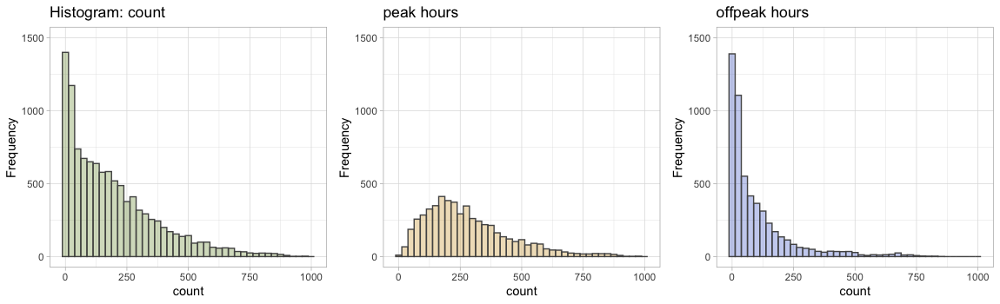
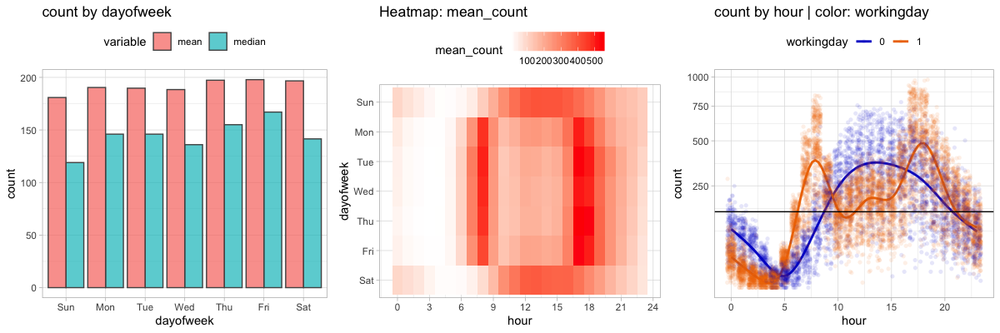
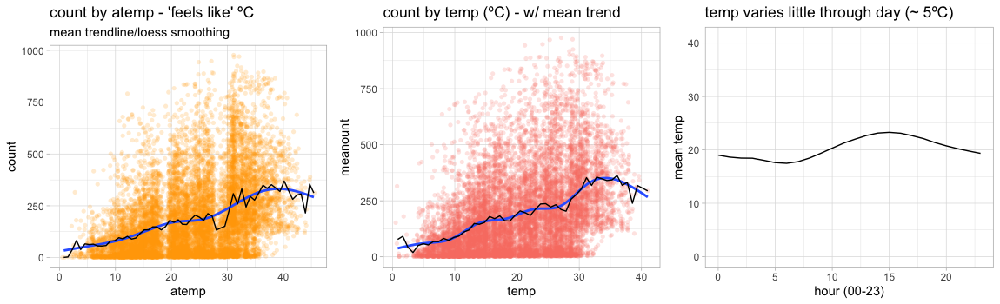
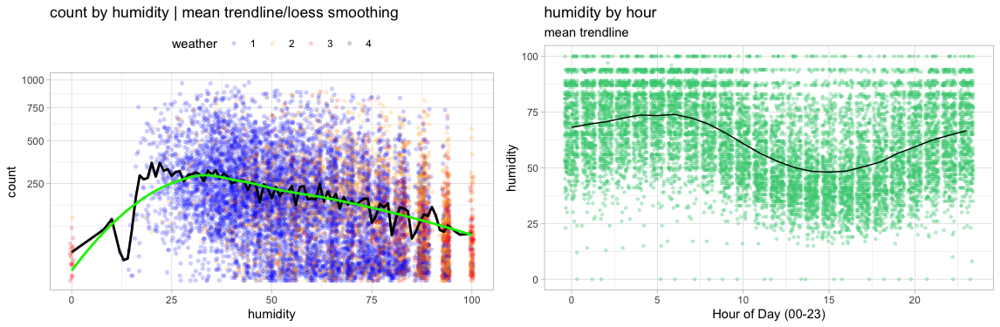
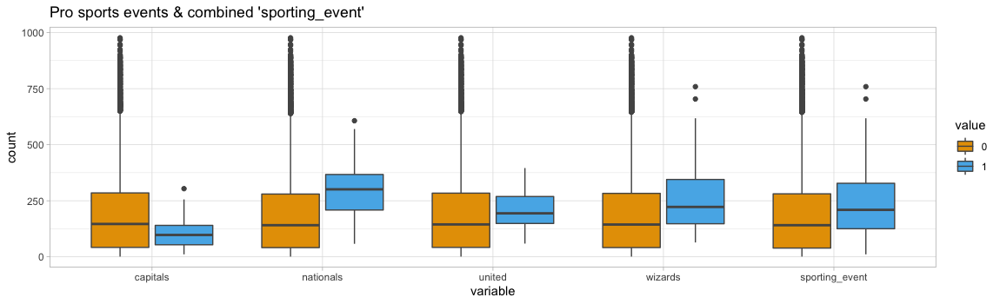
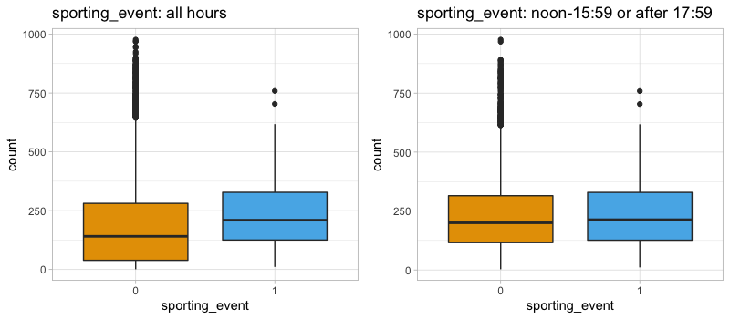

# Project - CIS 575
# Part 3 - Final Report - Kevin F. Cullen

(8 to 20 pages excluding appendices)

Relevant output from your analyses should be included in the Appendix and referenced in the body of your report. The due date for the final report is Sunday, December 8.

## 1. Executive summary

insert

content

here

## 2. Business problem/opportunity (from proposal)

I used the Kaggle "Bike Sharing Demand" competition as a basis for my project: <https://www.kaggle.com/c/bike-sharing-demand/overview>. Several versions of the data are on Kaggle. I chose what seemed the earliest & most detailed.

Bike sharing companies must balance availability and demand of their vehicles to ensure (a) customers can borrow a bike when they need it and (b) bikes are repaired and in in good order.

The Kaggle challenge requests the following, where `count` is the number of bicycles rented in a given hour...

**Evaluation statistic:** Root Mean Squared Logarithmic Error (RMSLE)

Based on what I read, RMSLE is ideal for this target variable. See <https://hrngok.github.io/posts/metrics/> for example.

- `count` has a wide range
- Right-tailed distribution means percentage errors are more important than absolute value.
- `count` has a wide range
- A bike sharing scheme would probably want to penalize under estimates more than over estimates

**Submission format**

    datetime,count
    2011-01-20 00:00:00,0
    2011-01-20 01:00:00,0
    2011-01-20 02:00:00,0

## 3. Specific business objective(s) (from proposal)

Predict demand for bicycles, using time (date, time, holiday, weekday, season) and weather data. The various competitions do not make true business cases for the prediction based on ROI, etc. However, common sense dictates that sharing companies would want to use this data to keep costs low by having the lowest number of bicycles needed to meet demand. Predictions could also be used to schedule bicycle service and relocation for slower times. (I have read about gig workers whose job is to move ride share bikes and scooters to more central locations.)

I was troubled by issues with separation of timeframes when making a prediction. In other words, much of this data was weather-related and could not be accurately known beforehand. The `casual` and `registered` variables are also collected as part of `count`, so I didn't see how they could be used as a predictor.

## 4. Process followed for selecting and gathering data

### 4.a. Kaggle Data

Downloaded CSV files for training and test data from <https://www.kaggle.com/c/bike-sharing-demand/overview>.

### 4.b. Additional Data Series I Found and Transformed

Some of this was ugly cut & paste from PDFs or HTML into Excel. I used Pentaho/Vantara PDI to load CSVs into a MySQL database for transformations and joins via SQL.

I pulled the following subsets together via SQL SELECT with several OUTER JOINs. I exported the data to a CSV file with MySQL's SELECT... INTO OUTFILE syntax and brought into R for further exploration.

Related files...

    create+select.sql       transformations and joins
    bike_sharing.kjb        (Pentaho PDI ETL Job)
    kaggle_data.ktr         (Pentaho PDI Transformation file)
    kaggle_data_plus.csv    unified data file (test + train, kaggle + my additional data)

#### 4.b.1. House and Senate "in session" variables [house-senate-in-session.csv]

Perhaps DC is busier when the legislators are around. I created CSV files from the official calendars of the 112th Congress (<https://www.congress.gov/past-days-in-session>). It took 10 minutes and seemed faster than screen-scraping.

Variables

    Date        iso date
    House       binary
    Senate      binary

#### 4.b.2. University calendars [dc-university-sessions.csv]

University students are a prime demographic for bike sharing. I wanted to capture days when students were likely in town, but not burdened by exams, etc. I found 2011 calendars for the 3rd, 4th, and 5th-largest universities in the DC area (but not 1st or 2nd). I made a CSV to demark days I considered class to be in session. I included weekends but excluded: Thanksgiving breaks, spring breaks, exam weeks, and summer sessions.

Variables...

    cua_session        binary    Catholic University of America
    au_session         binary    American University
    howard_session     binary    Howard University
    session_count      integer   # of universities in session
    session_any        binary    any universities in session?

#### 4.b.3. Pro sports schedules (DC-area home games)

Who drives to a pro sporting event? So, I captured (in CSV files) time windows for professional sporting events held within the geographic footprint of the bike share service. I excluded the Washington Redskins because the play in Landover, Maryland... outside the bike sharing service area.

Formats varied greatly. Once the CSVs were in MySQL, I massaged and joined them into a common table.

    +-----------+----------+
    | Field     | Type     |
    +-----------+----------+
    | datetime  | datetime | To join with the Kaggle hourly time data.
    | capitals  | boolean  | Is there a game at this time?
    | nationals | boolean  | Game?
    | united    | boolean  | Game?
    | wizards   | boolean  | Game?
    +-----------+----------+

Using start times from the CSV files + typical game lengths, I used SQL to set the binary flag to TRUE for hours during which games were being held, along with a bit of buffer on either side for travel to and from the games. I excluded away games for all.

##### 4.b.3.1. Washington Capitals (NHL) [capitals-schedule-2011.csv]

Gathered from: <https://www.nhl.com/capitals/news/capitals-announce-composite-2010-11-television-schedule/c-537574> and <https://www.hockey-reference.com/teams/WSH/2012_games.html>

Variables

    capitals    binary
    caps_date   iso date
    caps_time   (HH:mm:ss)

##### 4.b.3.2. Washington Nationals (MLB) [nationals-schedule-2011.csv]

Gathered from: <https://www.retrosheet.org/schedule/>

Variables

    Date                    string (yyyymmdd)
    Nationals_Game          binary
    Nationals_Game_Time     string

I replaced `Nationals_Game_Time` strings ("D" or "N") with typical game times.
- D (Day) ~13:05
- N (Night) ~19:05

##### 4.b.3.3. Washington Wizards (NBA) [washington-wizards-2011-schedule.csv]

Gathered from: <https://www.basketball-reference.com/teams/WAS/2012_games.html>.

Variables

    start_ET      time (HH:mm:ss)
    Date_iso      iso date

##### 4.b.3.4. DC United (MLS) [dc_united-2011-schedule.csv]

Gathered from: <https://en.wikipedia.org/wiki/2011_D.C._United_season>

Variables

    DC_United_Game_date      iso date
    time_ET                  time (HH:mm:ss)

## 5. Discussion of preliminary data exploration and findings

The data was clean. The only missing values were the counts in the test data set.

    > describe(bikeall.df$count)
    bikeall.df$count
           n  missing distinct  Info   Mean      Gmd  .05    .10    .25    .50    .75    .90    .95
       10886   6493    822        1    191.6   193.3  5.0    9.0   42.0  145.0  284.0  452.0  563.8

    lowest :   1   2   3   4   5, highest: 943 948 968 970 977

**Target variable `count`** ranged from 1 to 977
  - median: 145
  - mean: 191
  - distribution: heavily right-tailed; peaks at far left (x = 1 to 5)

Kaggle provided `datetime`, an hourly timestamp. I extracted `hour` and `dayofweek` from that because I expected those to be influential.

There are significant `count` peaks at 08:00 and 17:00 - 18:00 (presumably for rush hour).

Total `count` varied little by day of week. I dug deeper and discovered that timing of `count` did vary by day. My scatterplot and heatmap show weekend `count` has two different daily peaks which are broader and less distinct: 23:00 - 00:00 and 10:00 to 15:00 (possibly because people are cycling home from late night events and getting up late the next day).

I tried several ways to examine the `holiday` variable, all of which showed little `count` difference for `holiday` vs. non-holiday (though holidays lacked the huge outliers found on other days).

`weather` and `season` seemed to influence demand. However, spring (1) `count` was much lower than other seasons. Perhaps the service launched that spring. Weather had 4 categorical values, but one only had a frequency of 3 (among 10,000+ records).

My observations about temperature (both `atemp` and `temp`) were
- `count` is rarely low when the temperature is very high
  - (and rarely high when temperature is very low)
- `count` increases with temperature until about 35ºF
- temperature in DC varies only ~5ºC during the day.
- `temp` and `atemp` ranged from 0.82 - 41 and 0 - 50 respectively. Presumably, the original data was transformed to eliminate temperature below 0 Celcius. (Washington DC has plenty of hours/year below freezing.)

`humidity` did not correlate to `atemp` or `atemp - temp`, as I expected. However...
- `count` drops as `humidity` rises.
- `count` peaks at humidity < 25, though humidity is rarely that low, and generally only 13:00 - 17:00 (peak usage time).
- `weather` correlates strongly with `humidity`. As `humidity` rises, `weather` gets worse.
- `humidity` does not correlate with peaks in usage by hour.

 `windspeed` ranged 0 - 56. It was clearly pre-binned into 30 distinct values with a curious gap between 0 & 6.0032. Median `count` was roughly even, regardless of speed.

When the `house` and `senate` were in session, usage turned out to be lower. That may correlate with other variables, but I couldn't figure any out.

Pro sports events (home games) seemed to correlate with increase in `count`, apart from Capitals games. I decided to make my own `sporting_event` variable to combine all four teams for which I had data. However... the spike in `count` may be because games occur during busy periods (noon - 15:59 or after 17:59).

Universities all tended to be in or out of session at the same time (as seen in the histogram below). So... I created a consolidated `session_any` variable.

`count` was lower across the board when universities were in session. That surprised me.

## 6. Description of data preparation

Related file:

    create+select.sql

### 6.a. Repairs

- Manipulated various strings in SQL to make dates & times join up against Kaggle's datetime field. (`INSERT INTO... SELECT CONCAT`) (`LEFT OUTER JOIN... ON LEFT()`)

### 6.b. Replacements

- Replaced Nationals_Game_Time strings ("D" or "N") with typical game times so I use with other data.

### 6.c. Reductions

I thought about binning the `count` variable, but the object of the competition is to predict `count` accurately. So... using bins seemed like a bad way to get my Root Mean Squared Logarithmic Error (RMSLE) down.

The data from Kaggle appeared to have some previous binning. There were only 30 separate `windspeed` measurements.

`temp` and `atemp` had 50 and 65 distinct values and range for both had been shifted to start with 0. There were no units provided, but DC temperatures get below 0 Centigrade and rarely approach 0 Fahrenheit, so I am not sure what the exact prior transformation was.

`weather` was previously binned by the Kaggle competition. ~16 text descriptions were binned into three numeric values. Level 4 had only 4 observations, which caused all sorts of problems with modeling. Sometimes 4 would only appear in validation and not training.
1. Clear, Few clouds, Partly cloudy, Partly cloudy
2. Mist + Cloudy, Mist + Broken clouds, Mist + Few clouds, Mist
3. Light Snow, Light Rain + Thunderstorm + Scattered clouds, Light Rain + Scattered clouds
4. Heavy Rain + Ice Pallets + Thunderstorm + Mist, Snow + Fog

### 6.d. Partitions

I started by adding an id column to aid in sampling/partitioning and accuracy testing: `bikeall.df$id <- seq.int(nrow(bikeall.df))`

Because this Kaggle data set has no validation values in the testing data file, I created random training (60%) and validation (40%) data sets from the Kaggle train.csv file. I set a seed and used the same samples for all models when training & evaluating.

    ss <- sample(1:2, size = nrow(biketrain.df), replace = TRUE, prob = c(0.6, 0.4))
    training.df = biketrain.df[ss==1,]
    validation.df = biketrain.df[ss==2,]

### 6.e. Derivations

I derived the following variables from existing data...
- Separate `hour` field from the built-in `datetime` hourly time stamp. (MySQL `HOUR()` function)
- Separate `dayofweek` field from the built-in `datetime` hourly time stamp. (MySQL `DAYOFWEEK()` function)

I derived additional records for hours when people would be traveling to, attending, or traveling away from home games of 4 teams. I used SQL to `SELECT` start times for pro sporting events and then `INSERT` new records for the additional time periods. (`INSERT INTO... SELECT`)

### 6.f. Transformations

- Consolidated 4 teams' data into a single, binary `sporting_event` variable. (`LEFT OUTER JOIN` with a `SUBSELECT`)
- Consolidated 3 binary variables (`cua_session`, `howard_session`, `au_session`) into 1 (`session_any`), as long as any were true, since they were generally true at the same times. These variables represented three universities. (`LEFT OUTER JOIN` with a `SUBSELECT`)
- During plotting, I combined `house` and `senate` into a binary `congress_both` value, but did not include this in analysis. `bikeplot.df$congress_both <- ifelse(bikeplot.df$house == '1' | bikeplot.df$senate == '1', 1, 0)`
- During preliminary data exploration, I made log_scale transformations on data (`windspeed`, `temp`) to aid me in visualizing, but I didn't think they would be helpful in models.
- While plotting, I noticed scale_y_sqrt() made correlations more obvious because `count` on the y axis was very positively skewed. I added a count_sqrt variable to the MySQL export just in case.

For the Neural Network
- I converted several factors back to numeric. The Neural Network became grumpy when I used factors.
- I scaled all input variables using techniques found in this tutorial: <https://datascienceplus.com/fitting-neural-network-in-r/>

      maxs <- apply(nn_train.df, 2, max)
      mins <- apply(nn_train.df, 2, min)
      scaled <- as.data.frame(scale(nn_train.df, center = mins, scale = maxs - mins))

### 6.g. Clustering

I couldn't think of any reasons to cluster the data, given my assumption that regression analysis or neural networks would provide the best results.

## 7. Description of data modeling/analyses and assessments

### Multiple linear regression

- Quick and dirty
- Used my best-guess 10 variables, based on visualizations
- Adapted from textbook

### Linear regression with stepwise variable selection

- Wow... 3 of my derived variables and 2 of my added/created variables !!!

Call:

    lm(formula = count ~ id + hour + dayofweek + season + weather +
         temp_squared + atemp + humidity + windspeed + house + session_any,
       data = training.df, na.action = na.exclude)

### Regression tree

courtesy of tutorial: http://uc-r.github.io/regression_trees

- Textbook was sparse on predicting continuous outcome variables.
- The RMSLE was better than linear regression. I was a bit surprised.

### Neural Network

This took me a long time to get working.

- I had to scale variables, which required some code refactoring.
- nn often crashed out with error that "Algorithm did not converge in 1 of 1 repetition(s) within the stepmax."
  - I thought this was due to no scaling at first, due to recommendations I read.
  - Still happened after scaling.
- Training models took a long time. Especially with the 7-10 variables I threw at it.

## 8. Explanation of model comparisons and model selection

## 9. Conclusions and recommendations (i.e., what did you learn from the analysis; did you meet your stated business objective(s); how can the results of your analysis address the business problem/opportunity; what further analyses, that builds on your work, can be in done in the future)

